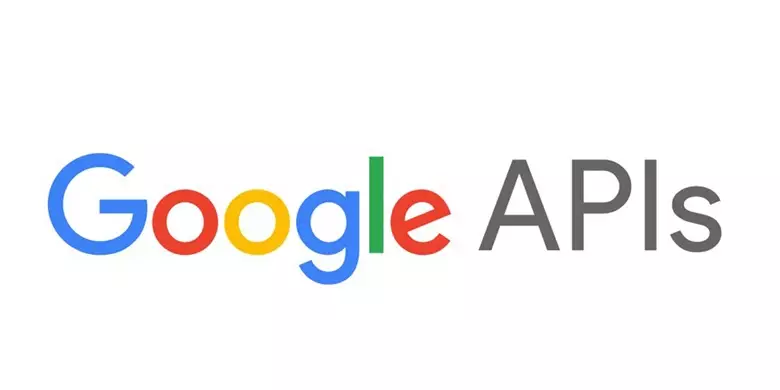
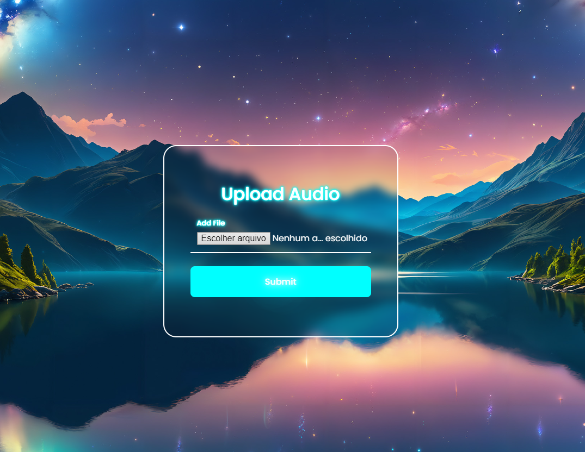
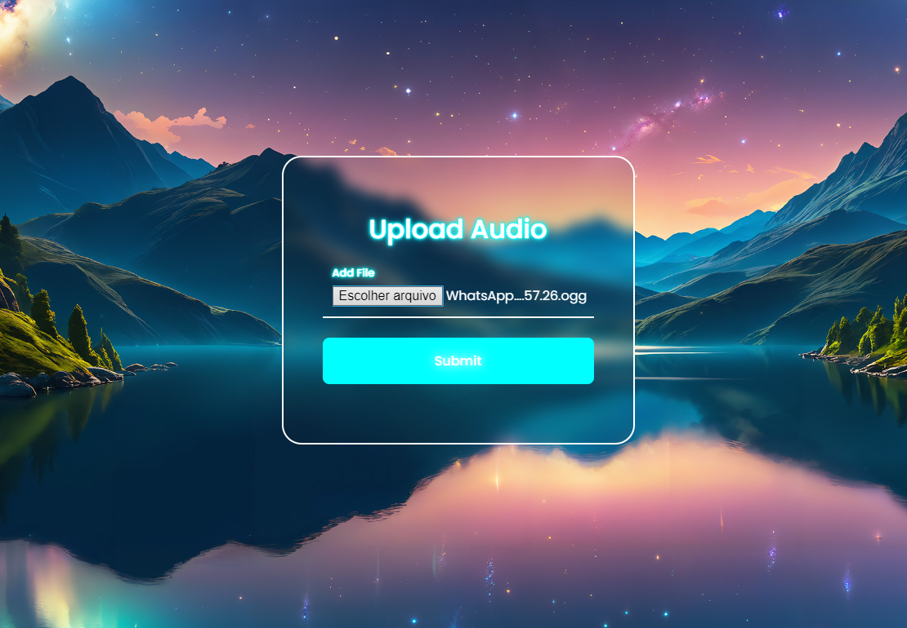
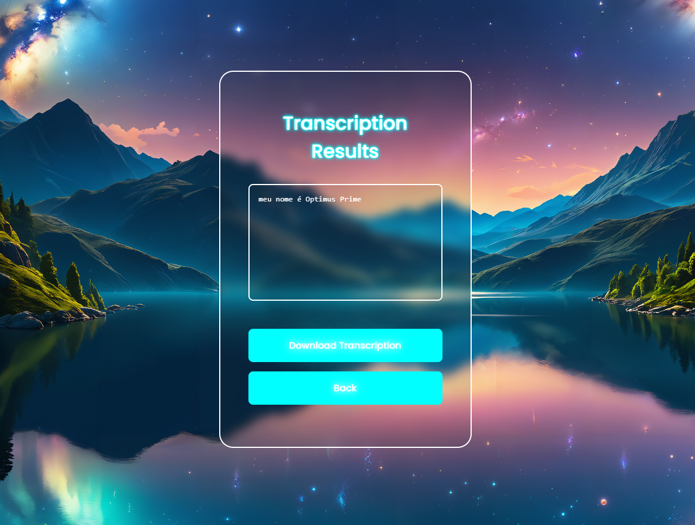

# Audio Writter - API
This code is a flask app, based on my mind. Created and developed in Visual Studio Code! :D

## Technology

1. Python

## Services Used
1. GitHub
2. Google Cloud API


# Project setup 
<span style="font-size:24px;">After cloning the repository</span>
```bash
#Open a terminal and navigate to the app.py file.
#And run the following code
flask run
```
<span style="font-size:24px;">After running, something like this should appear</span>

```bash
* Debug mode: off
WARNING: This is a development server. Do not use it in a production deployment. Use a production WSGI server instead.
* Running on http://127.0.0.1:5000
Press CTRL+C to quit
```
<span style="font-size:24px;">Once this is done, you just need to open Google and paste the IP that was provided</span>
# Important

If you really want to use this code, you will need a unique Key on Google Cloud

And for this you will need to install the .json of your Text-to-Speech API

I recommend researching the internet to better perform this installation function. Thanks!

# How to Use

<span style="font-size:24px;">Home page</span>



Here you can see that the interface is very simple, you just need to provide the audio file, which is in one of the following formats ".wav, .mp3, .ogg, .opus".

***



After adding the selected audio click on the "Submit" button and the code will do the rest.

***



On the last page, the text translated by the audio is written on the panel.

Below you can see the options for installing the .txt with the conversion.

And another button to return to the page, if you want to perform another conversion.


# Authors

1. <span style="font-size:24px;">Thales</span>


# Special thanks

**For everyone who made it this far, thank you for visiting. I hope you enjoyed the code.**


